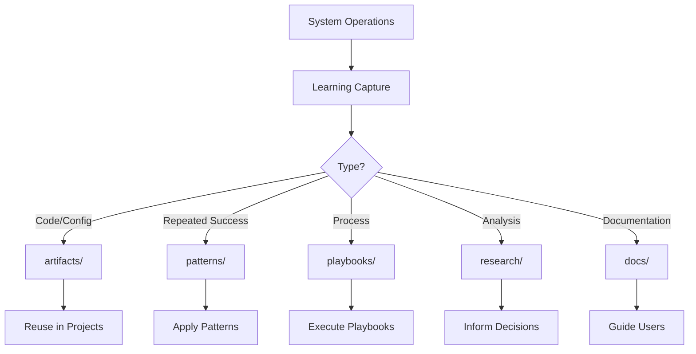

# NEXUS Vault System

> The knowledge repository where insights become assets

The Vault is NEXUS's persistent knowledge store, designed to capture, organize, and leverage all forms of intellectual capital generated through system operations.

## Directory Structure

```
vault/
├── artifacts/      # Build outputs and generated assets
├── docs/          # System documentation and help
├── patterns/      # Reusable solutions and best practices
├── playbooks/     # Step-by-step operational guides
└── research/      # Deep research reports and analyses
```

## How Each Directory Is Used

### 📦 **artifacts/**
Stores concrete outputs from agent operations:
- Generated code snippets
- Configuration templates
- Build artifacts
- Exported data structures
- Visual assets (diagrams, charts)

**Usage**: Agents automatically save reusable outputs here for future reference.

### 📚 **docs/**
Contains system documentation:
- Help files (nexus-help.md)
- API documentation
- Architecture guides
- User manuals
- Integration guides

**Usage**: Updated during evolutions and when new features are added.

### 🎯 **patterns/**
Codifies successful approaches:
- Design patterns
- Code patterns
- Workflow patterns
- Architecture patterns
- Problem-solving templates

**Usage**: When a solution proves effective multiple times, it graduates to a pattern.

### 📖 **playbooks/**
Operational guides for complex tasks:
- Deployment procedures
- Troubleshooting guides
- Migration strategies
- Scaling blueprints
- Emergency responses

**Usage**: Created when a complex process needs consistent execution.

### 🔬 **research/**
In-depth analysis reports:
- Technology evaluations
- Market research
- Competitive analysis
- Feasibility studies
- Innovation explorations

**Usage**: Use `/nexus/research <topic>` to create structured research reports.

## Learning Capture Flow



## Best Practices

### 1. **Naming Conventions**
- Use kebab-case for files: `multi-agent-orchestration.md`
- Include dates for time-sensitive content: `2024-q4-market-analysis.md`
- Version patterns: `rest-api-pattern-v2.md`

### 2. **Content Structure**
All vault content should include:
- Clear title and purpose
- Metadata (date, author, version)
- Executive summary
- Detailed content
- Actionable next steps

### 3. **Cross-Referencing**
- Link between related documents
- Reference patterns in playbooks
- Cite research in documentation
- Tag artifacts with their sources

### 4. **Evolution Integration**
Vault content directly feeds into system evolution:
- Research informs new features
- Patterns guide implementation
- Playbooks ensure consistency
- Artifacts provide building blocks

## Vault Commands

```bash
# Create new research
/nexus/research "topic name"

# Document a pattern
echo "## Pattern Name" > vault/patterns/new-pattern.md

# Archive an artifact
cp generated-file.yml vault/artifacts/

# Create a playbook
cat > vault/playbooks/process-name.md << EOF
# Playbook: Process Name
## Steps
1. First step
2. Second step
EOF
```

## Knowledge Lifecycle

1. **Capture**: Information enters through research, operations, or experiments
2. **Organize**: Structured storage in appropriate vault directory
3. **Refine**: Content improved through use and feedback
4. **Apply**: Knowledge actively used in development
5. **Evolve**: Insights feed back into system improvements

## Integration with Learning System

The Vault works hand-in-hand with the learning system:
- Evolution learnings reference vault content
- Successful experiments become patterns
- Research drives evolution proposals
- Patterns inform agent behaviors

## For High Water Labs

The Vault serves as High Water Labs' institutional memory:
- **Product Ideas**: Research reports spark new SaaS concepts
- **Technical Assets**: Patterns accelerate development
- **Operational Excellence**: Playbooks ensure quality at scale
- **Competitive Intelligence**: Market research guides strategy

---

*"Knowledge isn't power until it's organized, accessible, and actionable."*
- NEXUS Vault Philosophy