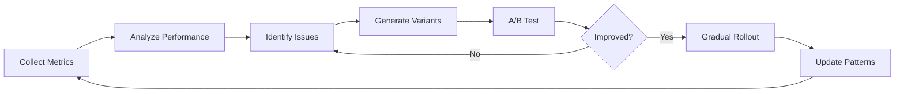

# Nexus Agent Iteration & Evaluation System (NAIES)

## System Overview

NAIES provides rapid iteration and quality evaluation capabilities for Nexus V2 agents, enabling continuous improvement through data-driven refinement.

## Architecture Components

### 1. Rapid Iteration Engine

#### Features:
- **Hot-Reload System**: Agents reload their prompts without restart
- **Version Control**: Git-based tracking of agent definitions
- **A/B Testing**: Parallel testing of agent variations
- **Rollout Control**: Gradual deployment of improvements

#### Implementation:
```bash
# Hot-reload watcher
.nexus/evaluation/hot-reload.sh

# Version tracking
.nexus/evaluation/versions/
├── product/
│   ├── v1.0-baseline.md
│   ├── v1.1-competitor-focus.md
│   └── v1.2-user-centric.md
└── [other agents]/
```

#### Workflow:
1. Create agent variant in `versions/[agent]/`
2. Enable hot-reload: `nexus eval --hot-reload`
3. Test variant: `nexus eval --test product:v1.1`
4. Compare results: `nexus eval --compare product:v1.0,v1.1`
5. Deploy gradually: `nexus eval --deploy product:v1.1 --rollout 10`

### 2. Quality Evaluation Framework

#### Metrics System:
```yaml
# .nexus/evaluation/metrics.yaml
core_metrics:
  response_quality:
    weight: 0.3
    evaluator: llm_judge
    criteria:
      - relevance
      - completeness
      - clarity
      - actionability
  
  task_completion:
    weight: 0.25
    evaluator: objective
    criteria:
      - requirements_met
      - deliverables_created
      - no_hallucinations
  
  collaboration_effectiveness:
    weight: 0.2
    evaluator: interaction_analysis
    criteria:
      - handoff_clarity
      - context_preservation
      - agent_coordination
  
  pattern_adherence:
    weight: 0.15
    evaluator: pattern_match
    criteria:
      - follows_patterns
      - applies_learnings
      - consistency
  
  user_satisfaction:
    weight: 0.1
    evaluator: feedback
    criteria:
      - task_success
      - experience_quality
      - would_recommend
```

#### Scoring Algorithm:
```python
def calculate_agent_score(agent, task_results):
    total_score = 0
    for metric, config in metrics.items():
        metric_score = evaluate_metric(agent, task_results, config)
        weighted_score = metric_score * config['weight']
        total_score += weighted_score
    return total_score
```

### 3. Monitoring & Analytics Dashboard

#### Real-time Monitoring:
```yaml
# .nexus/evaluation/monitoring.yaml
dashboards:
  agent_performance:
    panels:
      - quality_trends
      - error_rates
      - response_times
      - collaboration_graph
  
  iteration_tracking:
    panels:
      - version_comparison
      - rollout_status
      - a_b_test_results
      - improvement_velocity
```

#### Data Collection:
```json
{
  "session_id": "2025-08-01-001",
  "agent": "product",
  "version": "v1.1",
  "task": "competitor_analysis",
  "metrics": {
    "response_quality": 0.85,
    "task_completion": 0.90,
    "collaboration": 0.80,
    "pattern_adherence": 0.95,
    "user_satisfaction": null
  },
  "errors": [],
  "duration_ms": 3420,
  "tokens_used": 1250
}
```

### 4. Continuous Improvement Workflow

#### Feedback Loops:
1. **Automated Loop**: 
   - Collect metrics → Identify patterns → Generate improvements → Test variants

2. **Human-in-the-Loop**:
   - Review edge cases → Validate improvements → Approve deployments

3. **Pattern Learning**:
   - Successful improvements → Teacher agent → Update patterns

#### Improvement Pipeline:


## Implementation Guide

### Phase 1: Foundation (Week 1)
1. Set up evaluation directory structure
2. Implement basic hot-reload mechanism
3. Create metric collection system
4. Build simple comparison tool

### Phase 2: Core Features (Week 2-3)
1. Implement LLM-as-judge evaluator
2. Build A/B testing framework
3. Create version management system
4. Develop basic dashboard

### Phase 3: Advanced Features (Week 4-5)
1. Add automated improvement suggestions
2. Implement gradual rollout system
3. Create collaboration analysis
4. Build pattern integration

### Phase 4: Polish & Integration (Week 6)
1. Integrate with teacher agent
2. Add comprehensive documentation
3. Create example workflows
4. Performance optimization

## Usage Examples

### Testing a New Product Agent Variant
```bash
# Create variant focusing on user research
nexus eval create product:user-research-focus

# Test against baseline
nexus eval test product:user-research-focus \
  --tasks "market-analysis,feature-definition" \
  --compare-to product:baseline

# View results
nexus eval results --session latest --format dashboard
```

### Monitoring Agent Quality
```bash
# Start monitoring dashboard
nexus eval monitor --agents all --metrics all

# Set quality thresholds
nexus eval threshold --agent product --metric response_quality --min 0.8

# Get alerts for quality drops
nexus eval alerts --enable --channel slack
```

### Implementing Improvements
```bash
# Analyze recent performance
nexus eval analyze --period 7d --agent designer

# Generate improvement suggestions
nexus eval suggest --agent designer --based-on analysis

# Test improvements
nexus eval test designer:suggested-v1 --auto-rollout
```

## Integration with Nexus V2

### Directory Structure
```
.nexus/
├── patterns/          # Existing pattern storage
├── context/           # Existing context
└── evaluation/        # NEW: NAIES system
    ├── hot-reload.sh
    ├── metrics.yaml
    ├── monitoring.yaml
    ├── versions/      # Agent version history
    ├── results/       # Test results
    ├── analytics/     # Performance data
    └── tools/         # Evaluation utilities
```

### Teacher Agent Integration
The teacher agent will automatically capture successful improvements:
- Patterns that consistently score > 0.9 become permanent
- Failed patterns are documented for learning
- Gradual improvements are tracked over time

### Pattern File Updates
```markdown
## [Pattern Name]
**Added**: 2025-08-01
**Pattern**: [Description]
**Performance**: 0.92 (+0.15 from baseline)
**Validated**: 1000+ successful uses
```

## Success Criteria

1. **Iteration Speed**: < 5 minutes from edit to test results
2. **Quality Improvement**: 20% increase in average scores within 30 days
3. **Error Reduction**: 50% fewer task failures
4. **User Satisfaction**: > 4.5/5 rating
5. **Adoption**: All agents using NAIES within 60 days

## Next Steps

1. Validate design with stakeholders
2. Create proof-of-concept for hot-reload
3. Implement basic metric collection
4. Build minimal viable dashboard
5. Run pilot with product agent